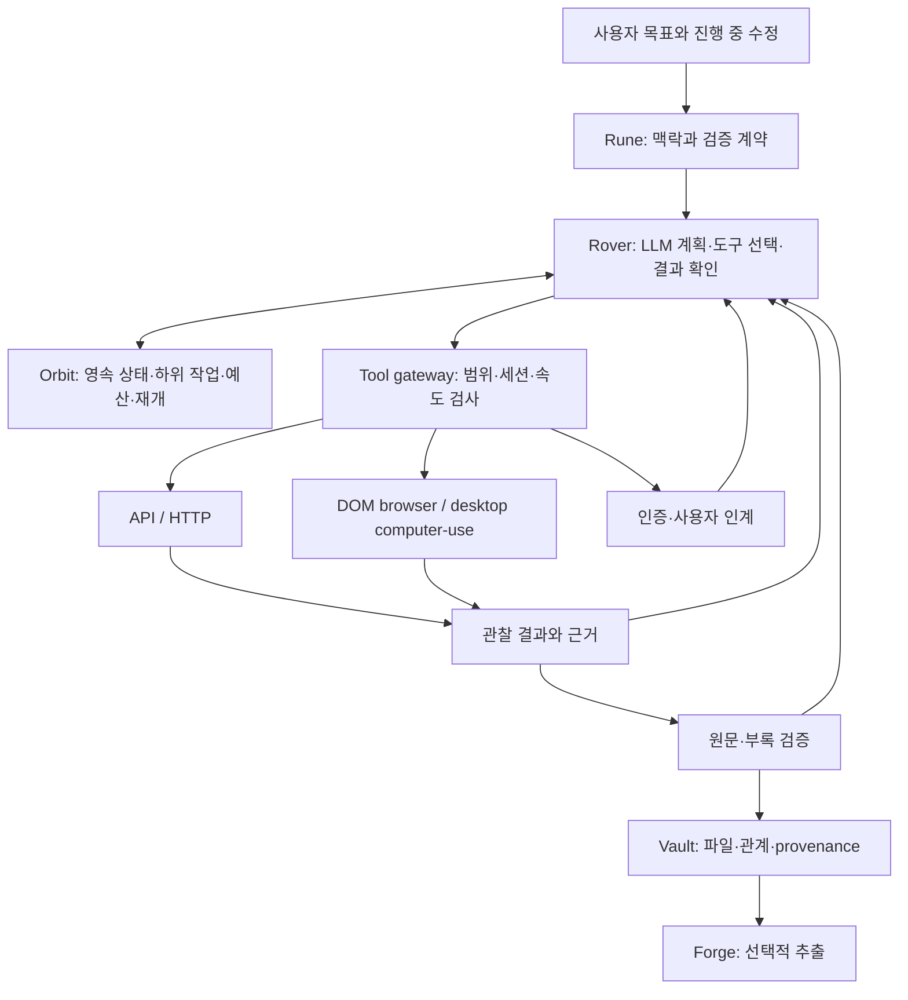

> 현재 0.5 구현 계약: [Native execution and measured reuse](docs/release-0.5.md). 아래 문서는 초기 설계와 이전 revision 기록을 보존합니다. 현재 실행 검증은 [VALIDATION](VALIDATION.md)을 기준으로 확인합니다.

> 구현 상태 (2026-09-10): 이 문서는 설계 근거와 과거 revision 기록을 보존한다. 현재 0.2.0rc1 구현, 실행 방법 및 실측 검증 범위는 [README](README.md), [0.2 release guide](docs/release-0.2.md), [VALIDATION](VALIDATION.md)을 기준으로 확인한다. Codex 연결은 native dynamic tools 대신 구조화된 행동 응답을 ORE가 검증·실행하는 방식이다.

> 0.3 구현: 대화/승인 → 범용 workflow → 버전된 capability → 기존 도구/격리 executor 구조를 추가했습니다. 구현 계약·적응 정책·중단 보장은 [0.3 설계 및 실행 안내](docs/release-0.3.md)에 정리되어 있습니다. 아래 초기 타당성 검토와 MVP 설명은 배경이며 현재 검증 결과는 [VALIDATION.md](VALIDATION.md)를 기준으로 합니다.

# ORE — Open Retrieval Engine

검토 기준일: 2026-09-10. 설계 개정: 0.4, 모델 선택·목표별 수집 경로·완전성 계약과 비교 평가. 상태: 타당성 검토 및 아키텍처 제안. 저장소는 조사 시 비어 있었다. 이 문서의 설정, 인터페이스, CLI는 제안이며 구현하거나 다운로드를 실행한 결과가 아니다. 특정 저널, 기관 계약, 모델 제공자, 배포 환경은 아직 지정되지 않았다.

ORE는 Codex·Claude Code처럼 LLM이 사용자의 목표와 사이트별 맥락을 읽고, 계획·도구 선택·관찰·결과 확인·재계획을 반복하는 수집 agent runtime으로 설계한다. LLM agent인 Rover가 전체 작업을 주도하고 API·HTTP·DOM browser·desktop computer-use·파일 검증을 도구로 사용한다. Orbit은 영속 상태와 병렬 실행을 관리하며, Rune은 agent가 따르는 맥락·절차·검증 계약이다. 제품 가치는 목표에 따른 적응적 실행, 재개 가능성, 절차 업데이트, 원문과 부속자료의 관계, 누락을 설명하는 보고서에 둔다. challenge 처리 성공과 추적 불가능성은 서로 다른 요구이며, 둘 모두를 모든 사이트에서 보장하지 않는다.

**타당성과 먼저 바로잡을 가정**

| 요구 | 판단 | 설계상 조건 |
| --- | --- | --- |
| 최근 20년의 권·호별 original article 목록 | 가능, 목록 완전성은 검증 필요 | 공식 목차와 메타데이터를 대조하고 출판 시기별 사이트 구조를 지원 |
| main PDF와 supplementary material | 제공·접근 가능한 파일에 대해 가능 | 파일별 탐색·권한·검증 상태와 본문 버전의 관계를 기록 |
| 사이트별 사전 정의 절차의 일반화 | 가능 | 유한한 작업 명세, 조건 분기, 반복, checkpoint, 확장 plugin |
| 가상 환경에서 병렬 agent 실행 | 가능 | 세션 격리, 중앙 속도 제한, 작업 임대, 재시작 및 비용 예산 |
| VPN을 쓰면 수집 사실을 추적할 수 없음 | 보장 불가 | 네트워크 경로, 기관 인증, publisher 로그, 모델 전송을 분리해 다룸 |
| computer-use로 bot challenge를 항상 해결 | 보장 불가 | challenge 대기, 사용자 인계, 운영자 허용 API 경로를 지원 |
| 어떤 저널이든 20년치 전체 확보 | 사전 확약 불가 | 과거 파일 존재 여부, 백파일 구독, 첨부자료 유실, 제공 경로별 정책에 의존 |

WARP는 현재 공식 FAQ상 원래 IP를 Cloudflare IP로 대체한다. 이는 로그인·쿠키·API 키에 의한 식별이나 서비스 측 기록을 없앤다는 의미가 아니다. 패키지 이름만으로 추적 위험을 판단할 수도 없다. 구체적인 의존성의 telemetry 여부는 따로 점검해야 하며, 이번 검토에서 패키지별 telemetry 감사를 수행하지 않았다. [WARP FAQ](https://developers.cloudflare.com/warp-client/known-issues-and-faq/), [WARP 개인정보 처리 설명](https://developers.cloudflare.com/warp-client/privacy/).

기관 IP 인증은 등록된 네트워크 주소를 통해 구독 권한을 부여한다. 따라서 WARP 등으로 출구 IP를 바꾸면 해당 인증이 사라질 수 있다는 것이 설계상 추론이다. 기관이 제공하는 VPN·EZproxy·SSO와 일반 개인정보 보호용 VPN은 서로 다른 역할이다. 클라우드 VM에도 기관 구독 권한이 자동으로 이전되지 않는다. [Springer Nature IP 인증](https://support.springernature.com/en/support/solutions/articles/6000084589-ip-authentication), [기관 proxy 접근](https://support.springernature.com/en/support/solutions/articles/6000083757-proxies).

GPT-6 Astra는 공식 문서상 computer use와 tool calling을 지원한다. ORE의 주 agent 모델 후보로 사용할 수 있다. 이번 검토에서는 특정 저널의 bot challenge 통과나 성공률을 시험하지 않았으며, 공식 모델 설명에서 임의 사이트의 challenge 통과 보장을 확인한 것도 아니다. [GPT-6 Astra](https://developers.openai.com/api/docs/models/gpt-6-astra), [computer-use 실행 루프](https://developers.openai.com/api/docs/guides/tools-computer-use).

Cloudflare가 자동화 브라우저를 production challenge 해결용으로 지원하지 않는다는 문구는 개별 모델이 모든 challenge에 반드시 실패한다는 증거가 아니다. 화면 조작 능력, 사이트가 허용하는 접근, 실제 통과 여부를 별도로 검증한다. challenge를 통과해도 요청 IP·인증 세션·제공처 기록이 없어지는 것은 아니다. WARP, challenge 서비스, cloud browser도 별개 기능이다. [Cloudflare 지원 브라우저](https://developers.cloudflare.com/cloudflare-challenges/reference/supported-browsers/).

**국외·국내 학술자료의 실제 접근 경로**

국가보다 메타데이터 제공처, 파일 제공처, 접근 계약을 기준으로 adapter를 나누는 것이 재사용에 유리하다. 국내 학술지가 국제 플랫폼이나 PMC에 원문을 제공하는 경우에도 동일한 retrieval adapter를 사용할 수 있다.

| 대상 | 발견·목록 경로 | 본문·부속자료 경로와 한계 |
| --- | --- | --- |
| 국제 저널 서지정보 | Crossref의 ISSN별 works와 출판사 목차 | Crossref는 메타데이터 및 등록된 링크를 제공한다. 그 자체가 모든 PDF·부록의 저장소는 아니다. [공식 API](https://www.crossref.org/documentation/retrieve-metadata/rest-api/) |
| DOI의 OA 사본 | Unpaywall의 OA location | PDF URL이 없으면 landing page만 있을 수 있다. 출판본·저자수락본·투고본을 구분한다. [공식 데이터 형식](https://unpaywall.org/data-format) |
| PMC 배포 대상 자료 | PMC 식별자·dataset metadata | 현행 Cloud Service의 HTTPS/S3로 파일을 받는다. 전체 PMC 논문의 PDF·첨부가 모두 배포되는 것은 아니다. [데이터셋 안내](https://pmc.ncbi.nlm.nih.gov/tools/textmining/) |
| 구독형 국제 출판사 | 출판사 API·목차 | 구독·TDM 조건과 제공 형식별로 처리한다. Elsevier의 학술기관 TDM 정책은 비상업 연구용 full-text API와 XML 접근을 설명한다. PDF와 모든 supplement까지 포함된다고 확대 해석하지 않는다. [정책](https://www.elsevier.com/about/policies-and-standards/text-and-data-mining) |
| 국내 의학 저널 | KoreaMed → Synapse 또는 학회 | Synapse는 XML 기반 전문 플랫폼이며 PDF 제출 규격도 운영한다. 저널 본문과 첨부 링크를 각각 해석한다. [KoreaMed](https://www.koreamed.org/Help-KoreaMed.php), [Synapse](https://www.kamje.or.kr/service/synapse) |
| KCI | Open API·OAI-PMH | 권·호·발행연월·DOI·원문 URL/공개여부로 inventory를 구성한다. 원문과 부록 다운로드는 별도 단계다. [OAI-PMH 명세](https://kci.go.kr/kciportal/po/openapi/openDataOaiPmhView.kci) |
| ScienceON | 현행 API Gateway의 논문 검색 | 검색과 실제 파일 제공 범위를 구분한다. KISTI는 2025년 기존 영문 저널 검색 API 폐기와 ScienceON 대체를 공지했다. [공식 변경 공지](https://www.data.go.kr/bbs/ntc/selectNotice.do?originId=NOTICE_0000000004206) |
| DBpia | 검색·상세정보 API | 검색 키와 비즈니스 키가 구분된다. 이 API의 존재만으로 구독 PDF와 부록의 일괄 다운로드 권한을 추정하지 않는다. [공식 가이드](https://api.dbpia.co.kr/openApi/about/guide.do) |
| KISS | 기관 인증 및 제공처 화면 | 기관 IP·도서관 경유 접근을 보존한다. KISS는 사전 허가 없는 크롤링 제한을 명시하므로 해당 수집 경로를 확인해야 한다. [기관인증 FAQ](https://kiss.kstudy.com/Cs/Faq?gubun=2) |
| RISS | 검색 결과의 원문 제공처 연결 | 연결된 KCI·ScienceON·상용 DB 등으로 resolution을 이어간다. 이번 조사에서 범용 PDF·부록 배포 API는 확인하지 못했다. [제공처 연결 예](https://www.riss.kr/search/Search.do?colName=re_a_kor&isDetailSearch=Y&queryText=znSubject%2C+open+API&searchGubun=true) |

PMC는 특히 최신 경로를 사용해야 한다. 기존 OA Web Service는 2026-08-25 안내에서 종료되었고, 기존 FTP/Cloud dataset 파일은 8월 24일 주간에 제거되었다고 공지했다. 새 adapter는 현행 dataset을 기준으로 작성한다. [OA API 종료](https://pmc.ncbi.nlm.nih.gov/tools/oa-service/), [FTP 전환 공지](https://pmc.ncbi.nlm.nih.gov/tools/ftp/).

현행 PMC AWS 배포는 `pmc-oa-opendata`의 article-version 단위 객체를 제공한다. JSON의 `pdf_url`, `media_urls` 등과 JATS XML의 관계를 이용해 본문·이미지·supplement를 구분할 수 있다. `media_urls` 전체를 supplement로 분류해서는 안 된다. 파일 제공은 해당 버전의 라이선스와 가용성에 의존하며, 이 구조를 확인한 것이 실제 다운로드 검증을 뜻하지는 않는다. [현행 AWS 설명](https://pmc.ncbi.nlm.nih.gov/tools/pmcaws/), [공식 dataset README](https://pmc-oa-opendata.s3.amazonaws.com/README.txt).

**ORE의 일반화 단위**

`Collection → Resource → Artifact`를 코어 모델로 둔다. 학술용 pack에서 Collection은 저널·권·호, Resource는 논문, Artifact는 본문·부록 파일이 된다. 도서에서는 시리즈·도서·판본·장으로, 공공자료에서는 기관·보고서·첨부로 매핑한다. 코어에 journal/DOI/issue를 필수 필드로 고정하지 않는다.

사용자가 설명한 순차 절차는 agent의 작업 지침으로 유지한다. Rover가 목표를 분해하고 현재 페이지·수집 상태에 따라 다음 행동과 하위 작업을 선택한다. Rune은 필수 선후관계와 권장 순서를 구분한다. 화면이 바뀌면 허용 범위 안에서 탐색 계획을 수정하고 변경 근거를 남긴다. 실행은 목록 반복, 논문별 작업, 파일별 처리, 실패 후 재개를 갖는 동적 작업 그래프가 되며, 기계 검사는 범위·입출력·완료 조건을 집행한다.



| 구성요소 | 책임 | MVP 구현 경계 |
| --- | --- | --- |
| Rune | 자연어 지침, 사이트 맥락, 필수 계약, 선택적 recipes, 버전 | Markdown + YAML/JSON Schema. 한 파일로 시작 가능 |
| Orbit | 작업 생성·임대·재시도·재개·속도 제한·보고 | 단일 coordinator와 SQLite. 분산은 후속 단계 |
| Retrieval adapters | API 응답, HTML, JATS, 다운로드 이벤트 해석 | 공통 typed interface를 구현하는 plugin |
| Rover | 목표 분해·계획·도구 선택·관찰·복구·완료 제안을 수행하는 주 LLM agent | 첫 MVP부터 실제 LLM 루프와 browser/desktop 도구 포함 |
| Vault | 원본 bytes, metadata, 관계, 검증 근거 | 파일시스템의 SHA-256 객체 + SQLite manifest |
| Forge | OCR·텍스트·표 추출 및 파생물 | 원문 수집 완료와 별도 상태. 후속 선택 기능 |

이 이름들은 모듈 경계다. 시작부터 각각을 서버나 별도 배포 패키지로 만들 필요는 없다.

**사용자 목표와 수집 전략의 계약**

범용성은 모든 사이트에 하나의 탐색 순서를 적용한다는 뜻이 아니다. Rune은 사이트별 맥락과 검증 방법을 재사용하고, mission은 이번 사용자가 원하는 범위·결과·종료 조건을 정의한다. Rover가 mission과 설치된 pack의 능력을 보고 실행 계획을 만든다. 다음 항목은 mission revision에 고정하며, agent가 비용을 줄이기 위해 조용히 바꾸지 못한다.

| mission 항목 | 확정할 내용 |
| --- | --- |
| 대상 세계와 검색 방식 | 지정 URL, 지정 저널 archive, 선택한 DB의 검색 결과, 여러 출처의 주제 검색 중 무엇인가 |
| 질의 의미 | 문자열·동의어·개념 검색, 제목/초록/본문 등 필드, 언어, 문헌 유형, 포함·제외 조건 |
| 기간과 시점 | 발행일/온라인일/권호일 기준, 기간 경계, 관찰 시점과 변경 처리 |
| 필요한 결과 | 문단·초록·본문 text·출판사 PDF·첨부·영상 metadata 등, 버전과 원문 위치 근거 |
| 완전성 수준 | 유한 목록 전수 대조, 체계적인 다중 출처 검색, 예산 내 탐색 중 하나 |
| 비용과 접근 | 시간·모델 사용량·사람 개입 예산, 사용 가능한 인증·네트워크·source, 보관/전송 조건 |

검색 의미가 달라지는 필수 정보는 현재 대화와 입력에서 먼저 도출한다. 그래도 결정할 수 없으면 해당 부분만 사용자에게 확인한다. 예를 들어 accepted manuscript를 허용하는지, 본문 키워드 검색인지 초록 검색인지가 결과를 바꾼다. 기존에 명시된 선택은 다시 묻지 않는다. 사용자에게는 자연어 목표와 읽을 수 있는 plan을 제공하며 YAML 작성은 필수가 아니다.

Rover는 두 종류의 결정을 수행한다. **대상 발견(discovery)**은 어떤 자원이 존재하고 조건에 맞는지 찾는다. **파일 확보(retrieval)**는 이미 찾은 자원의 어떤 버전·파일을 어디에서 얻을지 정한다. Unpaywall 같은 DOI resolver는 두 번째에 유용하며 주제·도서·일반 웹의 포괄 검색 엔진 역할을 대신하지 않는다.

| 사용자 요청 | 우선 검토할 발견 전략 | 결과 확인 |
| --- | --- | --- |
| 주어진 페이지의 특정 문단 | 해당 URL과 지정 section의 직접 관찰 | 원문 문자열·문맥·DOM 위치 또는 페이지 번호·관찰 시각 |
| 여러 저널에서 키워드 논문의 초록 | 저널/DB의 지원 필드와 질의 의미를 맞춘 검색, 식별자 대조 | 검색식·페이지 종료 근거·초록 출처·결측 여부 |
| 저널의 특정 연도 모든 original article | 공식 archive/TOC 열거와 독립 metadata 대조 | 과거 명칭·플랫폼·권호·논문 유형과 빠진 구간 |
| 주제별 가능한 많은 학술문헌 | 여러 DB의 검색식 변환·합집합·중복 해소, 요청 범위 내 인용 추적 | 출처별 고유 기여·미검색 source·잘린 결과·미판정 후보 |
| 지침·지속 갱신 문서·도서 | 공식 문서 목록, 제목/판본/개정일, 필요한 장·첨부 탐색 | 최신/특정 시점 버전, 원본과 개정 관계 |
| 쇼핑·뉴스·블로그·커뮤니티·YouTube | 해당 source의 검색/API/페이지 구조와 요구 매체에 맞는 pack | 상품 변형·게시물/댓글·영상/자막 등 서로 다른 대상과 관찰 시점 |

이 표는 전략 분류이며 각 사이트 adapter가 구현되어 있다는 뜻이 아니다. 검색 API 접근이 원문·영상·자막 확보 기능까지 제공한다는 가정도 하지 않는다. 기관 전용 source와 UpToDate 같은 구독 콘텐츠는 실제 제공 기능과 접근 프로필을 먼저 확인한다. 범용 코어는 유지하되 도메인별 identity·질의·완료 규칙은 pack으로 추가한다. 논문 DOI, 특허의 공개번호·관할·family, 도서의 판본·ISBN을 동일한 중복 규칙으로 처리하지 않는다.

**파일 확보 경로의 선택과 비용**

하나의 논문에 publisher API, publisher browser, PMC, 기관 저장소 등 여러 후보가 연결된 경로 그래프를 둔다. 후보에는 충족 가능한 artifact role·버전·형식, 필요한 권한/네트워크, 관찰 근거와 시각, 예상 요청 수·모델 사용량·시간·사람 개입·실패율을 기록한다. 먼저 계약과 접근 조건에 맞지 않는 경로를 제외하고, 남은 경로에서 전체 완료 비용을 비교한다. 비용 가중치와 우선순위는 mission에서 선택하며 근거 없는 종합 점수를 사실처럼 보고하지 않는다.

OA 우선은 고정 법칙이 아니다. 간단한 조건에서 OA 확인 비용을 c_oa, 요구물을 얻을 확률을 p, 직접 기관 경로 비용을 c_inst라고 하면 OA 선행 비용은 c_oa + (1-p) × c_inst다. 이는 순서가 후속 비용에 영향을 주지 않는다는 단순 예이며 p는 측정 전 미지수다. 실제 선택은 로그인 준비 비용, 세션 재사용, PDF 버전, 별도 supplement 방문, 만료 URL과 사용자 대기까지 포함해야 한다. 이미 기관 세션이 준비되어 있고 출판본 PDF와 publisher supplement가 모두 필요하면 publisher부터 가는 편이 나을 수 있다. 본문 text만 필요하고 OA 위치가 알려져 있다면 저장소가 더 적합할 수 있다.

Unpaywall 응답의 OA location은 submitted/accepted/published version을 구분하며 PDF URL은 없을 수 있다. OA 결과는 발견한 접근 가능한 사본이지 구독벽을 해제하는 기능이 아니다. 출판본을 요구한 작업에서 accepted manuscript를 확보해도 계약 완료로 처리하지 않는다. main PDF를 확보한 경로에 supplementary 전체가 있다는 가정도 하지 않고 파일별로 경로를 선택한다. [Unpaywall API](https://unpaywall.org/products/api), [응답과 버전 정의](https://unpaywall.org/data-format).

초기 policy는 관찰된 가용 경로·준비된 세션·캐시와 제한된 시도를 활용하는 규칙 기반 방식이다. 성공률과 지연은 source·시기·인증 상태별로 기록하고 새 site에는 그 수치를 그대로 적용하지 않는다. 충분한 평가 자료가 쌓인 뒤에만 통계적 routing을 도입한다. 모델이 제시한 확신도를 경로 성공 확률로 사용하지 않는다. 임의의 모든 경로를 시험하지 않고 추가 탐색의 기대 이익과 예산을 비교하되, 필수 검색원은 신규 결과가 적다는 이유만으로 생략하지 않는다. 전수 수집 계약에서 비싼 미확보 파일을 누락시키며 성공을 선언하지 않는다.

HTTP 200이어도 로그인·기관 외부 안내·challenge·빈 검색 결과 페이지인지 의미를 확인한다. 현재 네트워크에서 0건처럼 보이는 화면은 문헌 부재의 근거가 아닐 수 있다. 인증이 없으면 적절한 기관 worker 또는 승인된 접근 경로로 배정하고, 429는 공유 속도 제한과 대기로 처리한다. challenge는 기존의 영속 시도 예산과 사용자 인계를 따른다. worker·모델·OA fallback 변경으로 동일한 미해결 challenge 예산을 새로 시작하지 않는다. 독립적으로 접근 가능한 OA 자료를 확보해도 원래 세션의 차단 상태는 유지한다.

Route decision에는 후보·선택 근거·제외 사유·실제 결과·비용 관측을 남긴다. 접근 실패 캐시는 source와 인증/네트워크 맥락, 관찰 시각을 포함하고 만료 정책을 둔다. 어느 기관에서의 실패를 모든 사용자와 시점의 영구 실패로 만들지 않는다. 전역 최적 경로를 사전에 보장할 수는 없으며, 설명 가능한 선택과 관측에 따른 재계획을 제품 계약으로 삼는다.

**Rune의 구체적인 계약**

Rune은 agent용 작업 패키지다. 자연어 지침·사이트 맥락·권장 절차와 기계가 확인할 범위·출력·완료 조건을 함께 담는다. 작은 protocol은 YAML 한 파일의 instructions에 지침을 넣는다. 커지면 instructions.md, contract.yaml, 선택적 recipes.yaml과 fixtures를 묶고 전체 내용 digest를 고정한다. 이 파일명은 ORE의 제안 형식이며 특정 agent 제품의 자동 인식 기능을 가정하지 않는다.

명세는 `schema_version`, `protocol_id`, `protocol_version`, `inputs`, `instructions`, `context`, `agent`, `scope`, `milestones`, `checks`, `limits`, `access_profile_ref`로 구성한다. agent가 만드는 plan은 실행 중 revision을 올릴 수 있지만 완료 계약과 접근 범위는 임의로 완화할 수 없다. recipes의 step에는 ID·입력·도구·출력 schema·pre/postcondition·timeout·retry·checkpoint를 둔다. 반복에는 cursor와 종료 근거를 둔다. YAML은 실행 코드를 포함하지 않고, 추가 기능은 설치된 plugin을 참조한다.

일반적인 사이트는 내장 action의 조합과 설정으로 표현하고, 특수한 API·파일 형식에만 plugin 코드를 추가한다. 아래 예제의 `uses`는 여러 action을 묶어 배포한 재사용 adapter를 뜻한다. 단순한 저널을 추가할 때마다 새 Python 구현을 요구하는 구조로 만들지 않는다.

| 내장 action 제안 | 설정과 결과 |
| --- | --- |
| `http.request` | method, URL template, schema가 정한 query → 응답과 상태 |
| `browser.navigate`, `browser.click`, `browser.wait` | URL 또는 locator, 제한시간, 기대 상태 → 관찰 결과 |
| `extract.fields`, `extract.links` | JSON path·CSS·XPath·접근성 locator와 타입 → 근거를 포함한 필드·링크 |
| `flow.for_each`, `flow.branch`, `flow.paginate` | 입력 목록, 조건, cursor/next locator, 최대 횟수 → 다음 단계 |
| `emit.resource`, `emit.artifact` | identity와 관계 매핑 → 영속 수집 대상 |
| `artifact.retrieve`, `artifact.verify` | 후보와 요구 형식·identity → bytes와 검증 결과 |
| `user.await` | 대기 이유와 재개 조건 → checkpoint에서 재개 |

조건·template 표현식은 제한된 문법으로 평가하고 임의 코드 실행을 허용하지 않는다. locator에는 기대 개수와 실패 시 대안을 명시한다. pagination은 next 버튼 부재만으로 끝내지 않고 빈 페이지·반복 cursor·응답 total 등의 근거와 최대 범위를 검사한다.

아래는 문법·interface 제안이다. `example.org`, selectors, plugin ID는 예시이며 실제 저널에서 실행되는 설정이 아니다. 최근 20년은 예시상 완결된 20개 연도인 2006–2025년으로 정했다. 실행 시 rolling window 또는 2026년 포함 여부와 날짜 기준을 별도 입력으로 확정한다.

```yaml
schema_version: "ore.rune/v0"
protocol_id: "journal.example"
protocol_version: "0.4.0"
inputs:
  archive_url: "https://example.org/archive"
  publication_window:
    basis: "issue_date"
    from: "2006-01-01"
    until_exclusive: "2026-01-01"
instructions: |
  지정된 archive에서 대상 권호와 논문 목록을 확인한다.
  저널의 논문 유형 표시를 근거로 원저를 선정한다.
  각 논문의 출판본 PDF와 supplementary 자료를 찾고 검증한다.
  사이트 구조가 예상과 다르면 현재 화면을 관찰해 계획을 조정한다.
  불명확한 유형, 접근 불가, 확인하지 못한 부록은 근거와 함께 남긴다.
context:
  article_type_map:
    "Original Article": "original_research"
    "Research Article": "original_research"
  ambiguous_type: "needs_review"
agent:
  controller: "llm"
  backend: "codex_local"
  auth: "codex_managed_chatgpt"
  transport: "local_stdio"
  model_selection: "fixed"
  model: "gpt-6-astra"
  reasoning_effort: "high"
  planning: "adaptive_with_contract"
  tools: ["inventory", "api", "http", "browser", "computer", "artifact", "delegate"]
  recipe_selection: "agent_decides"
access_profile_ref: "local:approved-journal-access"
scope:
  origins: ["https://example.org"]
  asset_origins: ["https://files.example.org"]
  article_versions: ["published"]
  artifact_roles: ["main_pdf", "supplement"]
milestones:
  - id: inventory
    requires: []
    evidence: "collection_and_resource_inventory"
  - id: classify
    requires: ["inventory"]
    evidence: "eligibility_with_source_label"
  - id: collect
    requires: ["classify"]
    evidence: "main_and_supplement_observations"
  - id: audit
    requires: ["collect"]
    evidence: "verified_artifacts_and_unresolved_items"
checks:
  - "inventory_reconciled_with_official_toc"
  - "included_resources_have_main_pdf_status"
  - "included_resources_have_supplement_discovery_status"
limits:
  max_agent_workers: 4
  publisher_group_concurrency: 1
  origin_min_interval_seconds: 3
  transient_retries: 3
  agent_actions_per_resource: 30
  agent_seconds_per_resource: 300
  job_budget_ref: "local:research-pilot-budget"
on_challenge:
  mode: "bounded_attempt_then_handoff"
  max_attempts_per_episode: 3
  max_active_seconds: 120
  budget_scope: "origin_and_auth_context"
  counter_storage: "orbit"
  on_exhausted: "awaiting_user"
  handoff: "same_browser_session"
on_access_denied: "record_access_required"
```

위 속도와 agent 예산은 초기 설계값이며 허용량·성능 측정값이 아니다. job 전체의 시간·token·비용 한도도 필요하다. 서버 제한과 접근 프로필이 더 엄격하면 그것이 우선한다. `milestones`는 완료 의존성을 나타내고 각 단계의 실제 tool 순서는 agent가 선택한다. HTTP 401/403은 다른 도구를 통한 무제한 재시도의 조건이 아니다. `bounded_attempt_then_handoff`는 응답과 화면을 분류하고 허용된 도구·정상 브라우저 상호작용 범위에서 최대 3회 또는 누적 활성 시간 120초 중 먼저 도달하는 한도까지 시도한 뒤, 미해결이면 같은 브라우저 세션을 사용자에게 인계한다는 제안이다. 사용자 개입이 즉시 필요한 단계나 허용되지 않는 동작은 횟수를 채우지 않고 인계한다. 임의 challenge 우회나 자동 CAPTCHA 해결을 보장하는 설정이 아니다. 실패·검토 필요 상태도 출력 레코드로 남긴다.

Rune의 맥락에는 사이트 용어, 과거 플랫폼 기간, selector 대안, attachment의 표시 방식, 논문 유형 매핑 근거를 둔다. 예를 들어 `Letter`가 원저인지 여부는 저널별로 결정한다. 반복 실행마다 agent가 같은 화면을 다시 해석할 필요 없이 검증된 adapter를 재사용한다.

업데이트 흐름은 `시연/페이지 관찰 → Rune 초안 → 대표 페이지 검증 → 버전 발행 → 실행에서 버전 고정`이다. 시연은 agent가 DOM과 동작을 관찰해 지침·recipe 초안을 만드는 authoring 기능이다. 실행 중 화면이 바뀌어도 기존 계약 안에서 가능한 일회성 대체 탐색은 같은 Rune의 plan revision으로 처리한다. 재사용할 지침·recipe·selector 또는 완료 계약 자체를 바꾸는 경우에는 수정 근거를 저장하고 검증된 새 Rune 버전을 발행한다. 기존 버전을 덮어쓰지 않으며 새 버전 적용 시 mission revision에 사용한 digest를 기록한다. 완료 파일 재사용은 현재 scope·identity·검증 조건에 맞는 경우로 한정한다.

**Adapter와 agent의 경계**

| 제안 interface | 반환 계약 |
| --- | --- |
| `discover(scope, cursor, access)` | collection/resource 목록, next cursor, 페이지 종료 근거 |
| `classify(resource, evidence)` | included/excluded/needs_review, 원본 label, 판정 근거 |
| `resolve(resource, access)` | artifact 후보, 관계, discovery 상태, 만료 가능성 |
| `retrieve(candidate, session, sink)` | staged bytes, 실제 content type, 응답·redirect 근거 |
| `verify(staged, expected)` | format/identity/integrity 결과 및 불확실성 |
| `commit(verified, manifest)` | blob 참조, source observation, provenance edge |

Rover는 모든 작업의 계획 주체이며 API/HTTP·DOM·desktop computer-use는 선택 가능한 도구다. 화면 중심 protocol이면 처음부터 실제 browser/desktop을 관찰·조작할 수 있다. 대량 전송에서는 agent가 검증된 recipe나 batch download 도구에 여러 파일을 맡기고 결과·예외를 검토할 수 있다. 매 HTTP 요청마다 모델을 호출할 필요는 없다. API 응답, DOM, 관찰한 화면과 다운로드 이벤트를 링크의 근거로 보존한다. 추측한 주소를 관찰된 원문 주소처럼 기록하지 않는다.

agent는 선택된 페이지와 작업 상태만 받고, 정해진 tool을 통해 탐색한다. 사이트 본문이나 PDF 안의 지시문은 데이터로 다룬다. 페이지 내용으로 접근 범위, 인증 정보 제공, 외부 전송 대상을 변경할 수 없다. 실제 사용자 데스크톱 전체보다 전용 브라우저 프로필 또는 격리된 desktop 환경을 실행 대상으로 둔다.

**LLM agent loop와 실행 backend**

Rover의 반복은 `목표·상태 읽기 → 계획 또는 재계획 → 도구 선택 → 실행 → 관찰·검증 → 상태 반영`이다. LLM은 다음 행동과 하위 작업을 제안하고 Orbit은 임대·예산·작업 수명과 완료 계약을 집행한다. agent의 “완료했다”는 답변만으로 파일 확보를 확정하지 않는다. 사용자가 중간에 범위를 수정하면 mission revision을 남기고 영향받는 작업만 재계획한다.

개인 사용자의 기본 backend는 `codex_local`로 제안한다. ORE가 같은 사용자의 설치된 Codex를 SDK 또는 app-server로 제어하고, 모델 호출과 agent loop는 Codex가 수행한다. ORE는 mission·도구 실행 경계·작업 상태·검증·파일을 소유한다. ChatGPT 로그인은 Codex가 관리하며 ORE는 인증 파일의 토큰을 추출·복사해 일반 LLM API를 호출하지 않는다. [Codex 인증](https://learn.chatgpt.com/docs/auth), [App Server](https://learn.chatgpt.com/docs/app-server).

| backend | 모델·인증 | 로컬 실행과 용도 |
| --- | --- | --- |
| `codex_local` | 설치된 Codex의 기존 ChatGPT 로그인. 해당 사용자의 구독 한도 적용 | ORE·Codex 프로세스·브라우저를 로컬 실행. 모델용 GPU나 별도 API key는 필수 아님 |
| `model_api` | 사용자가 제공한 모델 서비스 API 인증·과금 | ORE가 자체 agent loop를 실행. 서비스·서버 배포에서 선택 가능 |
| `local_model` | 기관/사용자가 운영하는 모델 endpoint | 외부 모델 전송을 줄이려는 경우의 선택지. 모델·양자화·동시성에 맞는 하드웨어 필요 |

ChatGPT Plus/Pro는 Codex 접근을 포함하며, 현재 공식 문서는 SDK·scriptable workflow와 구독 사용량을 설명한다. 설치된 CLI·SDK·사용자 계정의 지원 기능을 실제로 확인해야 하며, 구독은 일반 OpenAI API의 이용권과 같지 않다. 모델 선택과 긴 작업의 사용량은 구독 한도의 영향을 받는다. 동일 계정의 여러 ORE worker가 별도 무료 사용량을 얻는 구조도 아니다. 한도 도달 시 job을 보존하고 재개하며 자동으로 유료 API 경로로 바꾸지 않는다. [요금제 및 한도](https://learn.chatgpt.com/docs/pricing), [Codex SDK](https://learn.chatgpt.com/docs/codex-sdk).

| 인터페이스 제안 | 책임 |
| --- | --- |
| `HarnessBackend` | 기본 `codex_local`의 turn·cancel·resume·구조화 이벤트 및 사용자 인계 연결 |
| `ToolRuntime.execute(call, access, lease)` | 입력·범위·세션·예산 검사 후 로컬 도구 실행, 관찰 근거 반환 |
| `AgentSessionStore` | ORE session ID, Codex thread ID, browser lease, 공개 계획·도구 결과·요약·사용량 저장 |
| `ModelBackend.generate(context, tool_schemas)` | 선택적 API/자체 serving backend에서 모델 tool call과 사용량 반환 |

Codex는 문서화된 SDK/app-server 연동을 사용하고, ORE의 browser·download·artifact 도구는 MCP 또는 backend가 지원하는 구조화 tool bridge로 연결한다. 단순 자동 실행은 `codex exec`의 JSON 이벤트로 시험할 수 있으나 대화 지속·도구 호출·사용자 인계가 필요한 제품 경로는 SDK/app-server로 구현한다. Codex 설치만으로 필요한 browser/desktop 도구가 모두 제공된다고 가정하지 않는다. 추가 shell·네트워크 도구의 실행 권한도 ORE gateway의 범위·속도 제한과 일치시켜야 한다. Claude Code 구독·SDK 연동 조건은 이번 수정에서 확인하지 않았다.

맥락에는 해당 작업의 Rune, 공개 계획, 필요한 페이지 관찰, 최근 도구 결과, DB 진행 상태를 넣는다. 긴 대화는 요약하고 원본 관찰은 참조로 보존한다. 재개 시 대화 요약만 믿지 않고 작업 DB와 manifest를 다시 조회한다. 모델의 비공개 사고 과정 저장을 요구하지 않는다. 실행 중 끊긴 tool call은 tool-call ID와 artifact 작업 키를 대조해 중복 반영을 막고 실제 상태를 확인한 뒤 재시도한다.

각 병렬 worker는 별도 agent session과 browser profile/desktop session을 임대한다. 같은 계정·기관의 사용량과 속도 한도는 공유한다. 상위 agent는 겹치지 않는 권호·논문 범위를 배정한다. 인증된 브라우저를 둘 이상의 agent가 동시에 조작하지 않는다. 다른 사용자가 설치한 ORE는 각자의 Codex 로그인으로 실행하며, 하나의 개인 구독을 여러 이용자에게 재배포하는 모델로 설계하지 않는다. 호스트가 달라지면 그 실행환경의 승인된 인증 구성을 사용한다.

**모델과 reasoning effort 선택**

모델 routing과 수집 경로 routing은 서로 다른 policy이며 Orbit 안의 작은 모듈로 시작한다. Rover는 계속 목표와 행동의 계획 주체다. 모든 판단마다 별도 supervisor LLM을 호출하거나 시작부터 여러 agent의 투표를 요구하지 않는다. 초기 MVP는 사용자가 선택한 강한 모델 한 개로 기준 성능을 확보하고, 품질을 유지함이 확인된 하위 작업부터 저비용 모델을 적용한다. 공식 모델 선택 안내도 정확도 목표를 먼저 달성한 뒤 비용·지연을 줄이는 순서를 권한다. [모델 선택 안내](https://developers.openai.com/api/docs/guides/model-selection).

실행 시 capability registry를 현재 backend에서 구성한다. Codex app-server의 `model/list`는 모델별 `supportedReasoningEfforts`, 기본 effort, 입력 modality 등의 정보를 제공한다. API 모델 목록을 Codex 계정의 실제 가용 모델 목록으로 대신하지 않는다. tool bridge의 동작과 권한도 별도 확인해야 한다. 모델 ID, runtime 버전, 지원 effort, 선택 policy 버전, 실제 사용 설정을 실행 기록에 남긴다. [Codex model/list](https://learn.chatgpt.com/docs/app-server).

2026-09-10 조회한 Astra 공개 API 문서의 effort는 low/medium/high/xhigh/max다. 사용자 화면 또는 다른 runtime의 ultra를 동일한 API 값으로 가정하지 않는다. backend가 ultra를 명시적으로 지원하면 그 값을 사용할 수 있지만, 지원하지 않으면 임의 전달하거나 조용히 max로 바꾸지 않는다. display label과 backend의 실제 enum을 분리한다. 모델별 effort는 공통 정확도 척도도 아니어서 Terra high와 Astra low의 성능 순서를 고정할 수 없다. [Astra API 모델](https://developers.openai.com/api/docs/models/gpt-6-astra).

자동 선택 입력은 작업 종류, 관찰된 사이트 구조의 새로움, 입력 길이·이미지 필요 여부, 오류가 미치는 범위, 검증 가능성, 실패 원인, 남은 사용량·시간이다. 후보 필터 후 검증된 작업군별 정책으로 모델과 effort를 선택한다. 모델의 자기 확신은 검증 근거를 대신하지 않는다. 다음은 평가할 초기 가설이며 성능이 측정된 배정표가 아니다.

| 작업 | 초기 운용/평가 후보 | 상향 또는 변경 근거 |
| --- | --- | --- |
| 새 mission 해석·검색 범위·사이트 전략 | 가용한 Astra + high를 기준 실행 후보로 사용 | 의미 충돌·계약 불일치가 남으면 지원 상위 effort와 추가 근거 탐색 |
| 낯선 화면·복잡한 유형/문헌 동일성 판단 | Astra 기준, Sol의 같은 작업 성능을 비교 | 독립 근거 간 불일치·validator 실패 시 재관찰/상향/검토 |
| 검증된 구조의 반복 필드 추출 | 기준 모델로 먼저 확인 후 Terra/Sol + low/medium 평가 | template 변화·불확실한 제외 판정·필드 오류 시 강한 모델로 회수 |
| 파일 전송·hash·cursor·수량 대조 | agent가 결정한 입력으로 일반 코드/도구 수행 | 전송 오류는 원인별 복구, 의미 판단이 필요할 때만 LLM |
| 인증·429·challenge | 접근·대기·인계 policy | reasoning effort를 늘리는 것으로 권한이나 quota를 대체하지 않음 |

Sol은 GPT-5.6의 flagship, Terra는 intelligence/cost 균형 역할로 문서화되어 있지만 ORE의 특정 업무에서 어느 모델이 더 나은지는 별도 검증 대상이다. 작은 모델의 재시도·상위 모델 호출·사람 확인까지 포함하면 Astra를 처음부터 쓰는 편이 더 저렴할 수도 있다. [Sol](https://developers.openai.com/api/docs/models/gpt-5.6-sol), [Terra](https://developers.openai.com/api/docs/models/gpt-5.6-terra).

정책 모드는 `fixed`와 후속 `quality_constrained_auto`를 제안한다. fixed는 지정 모델/effort를 유지하며 예산을 넘으면 상태를 보존한다. auto는 가용 모델 중 평가에서 품질 기준을 통과한 조합만 사용하고, 새 구조에서는 강한 기준 모델로 돌아간다. 문헌의 제외·잘못된 중복 병합처럼 누락을 만드는 결정은 성공 파일 표본만으로 검증하지 않고 제외/병합 후보도 감사한다. 지원되지 않는 조합이나 필요한 성능의 후보가 없으면 이를 보고하고 선택 또는 재개를 기다린다. 사용자 명시적 고정 설정이 auto보다 우선한다.

모델/effort 변경은 backend가 지원하는 turn 또는 하위 작업 경계에서 수행한다. 진행 중 tool 실행의 완료/중단을 정리하고 DB 상태·필요 관찰·검증 실패를 넘기며, 같은 일을 처음부터 반복하지 않는다. 실패 원인이 추론이면 effort/모델을 변경하고, 근거 부족이면 다른 관찰을 구하며, 접근 문제이면 route를 변경한다. 추가 추론의 기대 이익이 작거나 예산이 소진되면 미해결 상태와 사용자 검토를 남긴다.

API backend는 실제 token/tool 과금과 재시도 비용을, 구독 Codex backend는 관측 가능한 사용량·한도·대기·사람 개입을 기록한다. 구독 사용량을 API 가격표로 환산해 실제 청구액이라고 보고하지 않는다. 사용량이 호출별로 노출되지 않으면 미관측으로 표시한다. 모델 교체의 context 전달·cache 손실과 policy 자체의 비용도 비교에 포함한다. [Codex 사용량](https://learn.chatgpt.com/docs/pricing).

**Challenge 시도와 사용자 인계**

상태는 `detected → attempting → resolved | awaiting_user`로 기록한다. 예시 기본값은 미해결 episode당 3회, 활성 시간 120초다. 한 번의 시도는 runtime이 실행을 수락한 challenge 대응 동작 묶음이며 재시도·새로고침을 포함한다. 단순 screenshot 관찰은 시도 수와 별도로 동작·시간 예산을 소비한다. 성공 판정은 모델의 발언이 아니라 실제 목표 페이지·세션 상태의 확인으로 수행한다.

Orbit은 시도 직전 횟수를 원자적으로 예약·차감하고 episode ID와 결과를 영속 저장한다. 같은 origin·인증 맥락의 미해결 challenge는 worker 간 예산을 공유하며, resume·worker 교체·plan/mission revision·브라우저 재생성으로 한도를 초기화하지 않는다. 시도 중 종료되어 결과를 모르는 경우도 소비된 시도로 기록한다. 해결을 실제 확인해야 episode를 닫을 수 있고, 동일 차단을 새 episode로 바꿔 한도를 늘리지 않는다.

횟수 또는 시간 한도에 도달하면 같은 인증 맥락에서 영향받는 자동 작업을 중지하고 사용자에게 브라우저 제어권을 임대한다. 사용자가 직접 조작하는 동안 agent의 화면 조작을 잠근다. 가능하면 인증 세션과 기관 출구를 유지한다. 세션이 만료되면 재인증 후 목표 페이지와 남은 작업을 재확인한다. 미해결 episode의 추가 시도 예산은 사용자가 명시적으로 허용한 경우에만 새 budget epoch로 기록한다.

**영속 작업 상태와 병렬 실행**

작업 상태는 `queued → running → succeeded`를 기본으로 하고 `retry_wait`, `awaiting_auth`, `awaiting_user`, `needs_review`, `blocked`, `failed`, `cancelled`를 별도로 둔다. 작업 실행의 성공과 본문·부록 확보 완료는 다른 지표다. 예를 들어 resolver가 접근 불가를 정확히 기록하면 단계 실행은 끝나지만 문헌 확보는 미완료다.

| 상황 | 처리 |
| --- | --- |
| timeout·일시적 5xx | 제한된 재시도와 지수 backoff, 다음 시각 영속 저장 |
| 429 | `Retry-After`를 반영하고 동일 publisher/계정/출구의 작업을 함께 감속 |
| 401·로그인 만료 | 접근 프로필 갱신 대기, 동일 인증 세션의 추가 요청 중지 |
| 403 | 응답을 근거로 만료 링크·권한·challenge를 구분. 알 수 없으면 검토 상태 |
| challenge | 미해결 episode의 공유·영속 예산 내에서 최대 3회 또는 활성 120초 시도. 미해결이면 같은 세션에서 사용자 인계 |
| 404·링크 만료 | 원본 페이지에서 주소 재해석. 재시도 한도 후 unavailable/미확인 근거 기록 |
| selector 변경 | 관찰 근거를 저장하고 계약 내 대체 탐색은 plan revision으로 수행. 재사용 recipe 수정은 검증 후 새 Rune 버전 발행 |
| worker 종료 | lease 만료 후 재배정. 이전 worker의 늦은 commit은 lease token으로 거부 |

MVP에서는 한 coordinator가 SQLite에 상태를 기록하고 worker process에 임대한다. 여러 호스트가 하나의 SQLite 파일을 공유하는 구조는 사용하지 않는다. 분산 단계에서는 PostgreSQL과 원자적 lease 획득·heartbeat를 사용하고 객체 저장소를 공유한다. 복잡한 장기 workflow가 실제로 필요해진 경우에만 별도 workflow engine 채택을 평가한다.

발견 레코드 저장, 후속 작업 생성, 다음 cursor 저장은 하나의 DB transaction으로 처리한다. cursor만 먼저 진전시키면 중단 직전 페이지의 자료가 누락될 수 있다. 재관찰한 레코드는 안정된 identity로 중복 반영을 막는다.

작업은 at-least-once로 재실행될 수 있다. 논리 작업 키는 job의 관찰 세대와 mission revision, 대상의 collection/resource/artifact identity, step, protocol digest, 실제 입력 hash, 접근 주체 범위를 포함한다. commit 시 현재 mission revision과 lease 소유권을 함께 확인한다. 범위 변경 이전 worker의 늦은 결과는 새 revision의 완료 상태에 직접 반영하지 않고 이전 시도의 관찰로 보존한다. 한 논문의 main과 각 supplement는 서로 다른 artifact 작업이다. signed URL은 identity로 쓰지 않고 실행 시 resolve한 임시 locator로 다룬다. 다운로드와 저장은 임시 객체 → 검증 → content-addressed blob → DB commit 순으로 처리하고, orphan 객체 정리와 복구를 설계한다. 파일시스템과 DB 사이를 한 번의 원자적 transaction이라고 가정하지 않는다.

동일 job의 `resume`과 새로운 `refresh`를 구분한다. resume은 기본적으로 최신 확정 mission revision의 범위·입력 hash·Rune digest로 미완료 작업을 이어간다. 이전 revision을 명시적으로 재개하려면 별도 관찰 세대에서 실행하며 현재 revision을 덮어쓰지 않는다. refresh는 새 관찰 세대로 inventory·resolver를 다시 실행해 수정된 PDF와 추가된 첨부를 찾는다. 이전 파일은 관찰된 버전, 제공처의 변경 정보, 캐시 유효기간과 검증 조건이 충족될 때만 재사용한다. 변경 판정 근거가 없으면 파일을 다시 받아 hash로 비교하고 이전 관찰 이력을 보존한다.

전체 worker 수와 사이트에 보내는 동시 요청 수를 분리한다. 제한은 origin뿐 아니라 publisher 그룹·기관/API credential·출구 네트워크에도 적용한다. 여러 저널이 같은 플랫폼을 쓰면 합산 제한을 공유한다. 브라우저의 navigation·XHR 등도 대상 사이트 요청 예산에 포함하고, adapter 내부 요청이 coordinator의 제한을 우회하지 않게 한다. 병렬성은 독립 사이트와 로컬 검증·추출 작업에도 활용한다.

Playwright browser context는 쿠키·storage를 격리하는 데 유용하다. 이는 OS 격리나 독립 IP를 제공한다는 뜻은 아니다. DOM worker는 컨테이너·브라우저 프로필로 시작하고, 실제 desktop computer-use에는 화면과 입력 장치를 분리한 VM 등의 실행 환경을 사용한다. 같은 계정의 세션은 해당 이용 조건과 동시 접속 한도 안에서 임대한다. [Playwright context 설명](https://playwright.dev/python/docs/browser-contexts).

**본문과 supplementary material의 보존 계약**

supplement는 PDF로 한정하지 않는다. ZIP·DOCX·XLSX·CSV·이미지·영상과 별도 저장소 링크를 모두 후보로 다룬다. 논문의 supplementary file, supplementary issue, 본문 figure, 외부 전체 dataset을 구분한다. 외부 dataset은 참조와 파일 목록을 우선 기록하고 명시된 범위·용량 안에서만 내려받는다.

JATS의 supplement 참조, publisher의 첨부 목록, DOM의 supplementary 탭과 펼침 메뉴, API의 관계 필드를 adapter가 합쳐 발견한다. 본문 마지막 부분의 링크만 검사하는 방식으로 완료 판정을 내리지 않는다. bundle 안에 여러 파일이 있으면 원본 bundle과 그 구성원을 별도 객체로 보존한다.

| 객체 | 필수 정보 |
| --- | --- |
| Collection | source ID, parent 관계, 원문 title, ISSN 등 선택 식별자, 날짜 범위, inventory 관찰 시각 |
| Resource | canonical ID와 aliases, 원본 URL, 유형 원본값/정규화값/근거, 판본, issue·online 날짜, 포함 판정 |
| Artifact | resource/version 참조, role, 원본 이름, source locator, media type, bytes, SHA-256, 상태 |
| Relation | `has_main`, `has_supplement`, `contains`, `is_version_of`, `references_dataset`, 근거 |
| Observation | source URL 또는 보호된 locator, 조회 시각, adapter/protocol/실행환경 버전, 응답·검증 근거 |
| Task/Attempt | 입력 hash, 상태, lease, retry 횟수, 시간, 모델 사용량, 오류 분류 |

DOI가 있으면 정규화된 식별자로 활용하되 DOI 없는 논문은 제공처 ID·URL 등으로 추적한다. 제목만으로 자동 병합하지 않는다. 동일 논문의 저자수락본과 출판본, 서로 다른 시점의 파일은 독립 버전이다. PDF 요구를 XML·HTML 또는 브라우저의 인쇄 PDF로 조용히 충족 처리하지 않는다.

다운로드 완료 검사는 HTTP 200 여부 외에 content type, 파일 시그니처, parser 유효성, bytes, SHA-256을 확인한다. 로그인 HTML을 `.pdf`로 저장한 경우와 다른 논문의 PDF를 모두 탐지해야 한다. 문헌 identity는 DOI·제목·서지정보와 대조하고, OCR 없이는 확인되지 않는 스캔본은 integrity 성공과 identity 미확인을 분리한다. bytes가 같으면 저장을 중복 제거할 수 있지만 각 source observation과 접근 주체별 권한은 보존한다.

Playwright 다운로드는 context를 닫기 전에 관리되는 저장소에 저장해야 한다. 브라우저 다운로드 종료 신호도 올바른 문헌 파일임을 보증하지 않는다. [공식 다운로드 lifecycle](https://playwright.dev/python/docs/downloads).

ZIP 해제는 경로 이탈·symlink·중첩 깊이·압축 해제 크기를 제한한 별도 작업으로 수행한다. 원본 파일은 수정하지 않고 파생 텍스트·표·OCR 결과는 별도 Artifact로 만들어 도구 버전과 원본 hash를 연결한다.

**20년치 수집의 완료 기준**

가장 먼저 저널의 print/electronic ISSN, 과거 명칭, 플랫폼 이동 구간을 모은다. 공식 archive의 권·호 목록과 API inventory를 대조하고 불일치를 보존한다. 연속출판과 early-online 자료에는 가짜 issue 번호를 만들지 않는다. 현재 구독이 과거 20년의 backfile 권한까지 포함하는지도 접근 프로필의 범위로 표현한다.

출판일, 온라인 공개일, 권·호 배정일, API record 수정일을 별도 저장한다. KCI OAI-PMH의 datestamp는 마지막 저장 일자이므로 `from/until`을 발행연도 필터처럼 사용하면 안 된다. 최초 inventory와 증분 변경 탐색을 구분하고 실제 발행 필드로 대상 연도를 판정한다. [KCI 날짜 필드 정의](https://kci.go.kr/kciportal/po/openapi/openDataOaiPmhView.kci).

`journal-article` 또는 KCI의 정규논문 여부만으로 original article을 확정하지 않는다. 저널의 원래 article-type label과 검증된 매핑을 우선하고 review·editorial·case report·research letter의 취급을 pack에 명시한다. 애매한 항목은 분모에서 사라지지 않도록 별도 보류한다. 철회·정정은 관계와 상태를 기록해 원래 논문 및 수정 정보를 추적한다.

supplement 발견 상태는 `present`, `source_declares_none`, `not_listed_after_checks`, `unknown`으로 구분한다. 발견된 파일의 전송 상태는 별도로 `verified`, `access_required`, `unavailable`, `failed`, `pending` 등을 기록한다. 페이지에 링크가 보이지 않았다는 사실을 보충자료가 존재하지 않는다는 증거로 바꾸지 않는다.

보고서는 다음 분모를 분리한다. 대상이 0이면 비율을 100%로 만들지 않고 N/A와 건수를 표시한다.

| 지표 | 계산·해석 |
| --- | --- |
| Inventory coverage | 검증한 권·호 / 공식 목록에 있는 대상 권·호. 기준 목록 자체가 불완전하면 unknown을 표시 |
| Classification resolution | included+excluded / 전체 후보. needs_review를 함께 보고 |
| Main PDF coverage | 요구한 버전·identity·integrity의 main PDF를 확보한 논문 수 / 포함 확정 논문 수. 한 논문은 최대 한 번 계산 |
| Supplement inspection coverage | protocol이 요구한 탐색을 끝낸 논문 수 / 포함 확정 논문 수 |
| Known supplement retrieval | 검증된 첨부 수 / 발견된 대상 첨부 수. 발견하지 못한 파일까지 포함하는 지표가 아님 |
| End-to-end accounted status | 모든 후보·논문·첨부에 성공 또는 미해결 원인이 기록되어 있는지 |

`main_complete`, `supplement_discovery_complete_for_protocol`, `known_supplements_downloaded`, `unresolved_count`를 별도 보고한다. 실행이 끝났다고 전체 원문이 확보된 것은 아니다. 특히 20년치 전체 완전성은 기준 inventory와 supplement 발견 근거가 뒷받침하는 범위까지만 주장한다.

**여러 검색원의 색인 차이와 완전성의 한계**

완료 상태에는 mission이 정의한 대상 세계가 반드시 붙는다. (1) 지정한 archive/URL 목록의 유한 전수 대조, (2) 선택한 여러 DB에서 명시한 검색식을 끝까지 실행한 체계적 검색, (3) 예산 내에서 탐색한 결과를 구분한다. 두 번째와 세 번째에서 전 세계의 관련 콘텐츠를 모두 찾았다는 주장은 하지 않는다. DB에 색인되지 않았거나 검색 필드에 없는 내용을 모델의 추론으로 발견했다고 간주할 수 없다.

공식 검색원 문서에서도 결과 집합의 경계를 확인할 수 있다. 다음 한계는 2026-09-10 문서 확인값이며 실제 실행에서는 사용 endpoint·구독·응답을 다시 확인한다.

| 검색원 | 확인된 한계와 설계 영향 |
| --- | --- |
| PubMed | 원문 PDF를 담는 저장소가 아니라 citation/abstract와 원문 연결을 제공한다. ESearch의 PubMed/PMC 결과는 최초 10,000건 제한이 있으며 PubMed의 더 큰 집합은 EDirect 또는 적절한 쿼리 구획이 필요하다. 전체 count와 추출 고유 ID를 대조한다. [소개](https://pubmed.ncbi.nlm.nih.gov/about/), [E-utilities](https://www.ncbi.nlm.nih.gov/books/NBK25499/) |
| Google Scholar | 쿼리당 최대 1,000개 결과를 표시하고 bulk access를 제공하지 않으며 특정 출처의 지속적 수록을 보장하지 않는다. 보완 발견 경로로 다루고 저널의 전수목록으로 사용하지 않는다. [공식 도움말](https://scholar.google.com/intl/us/scholar/help.html) |
| Web of Science | Starter API와 UI export는 다른 기능·한도다. 구독·선택 collection·기간·export 옵션을 기록하고 현재 허용 범위를 적용한다. metadata export 성공을 PDF 확보로 처리하지 않는다. [Starter API](https://developer.clarivate.com/apis/wos-starter), [export 도움말](https://webofscience.zendesk.com/hc/en-us/articles/20135824927505-Saving-and-Exporting-Marked-Lists) |
| Scopus | Search API의 offset/cursor 탐색과 UI export 한계가 다르다. 허용된 API에서 cursor/페이지 종료를 검증하고 선택 수록 DB와 저널 공식 목록을 대조한다. [API 가이드](https://dev.elsevier.com/guides/Scopus%20API%20Guide_V1_20230907.pdf), [export 도움말](https://www.elsevier.support/scopus/answer/how-do-i-export-documents-from-scopus) |

Source별로 실제 query·필드·언어/날짜 변환·검색 시각·관측 total·cursor/partition·추출 수·중복·truncation·접근 실패를 보존한다. DB마다 같은 문자열을 보내는 것이 같은 검색 의미를 보장하지 않는다. 제목/초록 검색으로 본문에만 등장하는 용어를 놓칠 수 있으며, 본문 미확보는 해당 조건의 negative가 아니라 unresolved다. 동의어·controlled vocabulary·인용 추적은 mission 범위에서 사용하고 query revision과 추가된 후보의 출처를 남긴다.

합집합을 만들 때 원본 source membership과 검색 provenance를 유지한다. DOI와 검증된 식별자 관계를 우선하고, 제목 유사도만으로 제외하거나 병합하지 않는다. 출처 간 겹침과 신규 후보 수는 탐색의 이익을 보여주지만 데이터베이스가 서로 독립이라는 보장은 없다. 신규 후보가 줄었다는 이유만으로 전체 recall 100%나 미발견 문헌 수를 계산하지 않는다.

| 보고할 축 | 의미와 필요한 근거 |
| --- | --- |
| 검색 실행 범위 | 요청한 source 중 완료·실패·미지원 source, 정확한 질의와 제한 |
| 목록 대조 범위 | 지정 snapshot의 기준 inventory와 확인한 항목, 기준 자체의 결손 |
| 선별 정확성과 미판정 | 포함/제외/보류 수, 판정 근거, 독립 기준이 있을 때의 평가 |
| 파일 확보 범위 | 요구 버전의 main과 발견된 첨부별 검증/실패/미확인 |
| 전체 관련 자료 recall | 외부의 독립 기준집합이 있으면 그 기준에 대한 값, 없으면 unknown |

가령 지정 목차 snapshot의 240개 권호를 모두 대조했다면 해당 목록 대비 240/240이라고 보고할 수 있다. 이를 세상에 존재하는 모든 논문이나 모든 supplementary의 100% 확보로 확장하지 않는다. 알 수 있는 누락과 아직 관찰하지 못한 범위를 report에서 구분한다. 완전성의 분모를 다운로드 가능한 문헌만으로 바꾸지 않는다.

검색 중 원본 목록이 변하면 관찰 구간과 변경을 기록하고, 제공처가 snapshot을 지원하지 않으면 단일 시점의 원자적 snapshot이라고 표시하지 않는다. 페이지 종료·공식 count 대조·기간 구획 누락 여부 등을 확인한다. 예산 소진, export cap, 해소하지 못한 cursor, 인증 실패는 실행 중지 이유이며 전수 완료 근거가 아니다. 열거가 가능한 범위를 모두 끝냈는지와 선택한 검색식이 모든 관련 자료를 찾는지는 별개 질문이다.

**기관 내 실행과 개인정보 보호의 범위**

subscription journal 접근에는 원문 요청을 보내는 browser/API worker의 네트워크·인증 위치가 중요하다. 기관 내 PC/서버 또는 기관이 제공하는 원격 접근을 사용할 수 있다. LLM 추론은 별도 위치에서 실행될 수 있으며, 기관 안에 패키지를 설치했다는 사실만으로 모델 추론과 데이터 처리가 모두 기관 안에 남는 것은 아니다.

권장 기본 배치는 `기관 내 ORE coordinator + 구독 로그인한 로컬 Codex + 전용 browser/desktop workers + Vault`다. 모델 추론은 서비스 측에서 수행하므로 전용 GPU나 모델 서버는 필수 구성요소가 아니다. 브라우저의 출구는 기관이 승인한 경로를 사용하고 기관 로그인·쿠키·원본 파일은 기관 내에 유지한다. 모델에는 허용된 관찰만 보내며 tool call은 기관 내 runtime이 실행한다. 수집용 VM을 여러 개 만들어도 인증·기록 특성은 바뀌지 않는다.

기관 구독 권한을 유지하면서 출판사·기관·모델 제공자 모두에게 추적 불가능함을 보장하는 것은 이 설계의 달성 가능한 요구가 아니다. 어느 관찰자에게 어떤 정보가 드러나는지를 구분한다. 아래는 일반적인 정보 경계이며 사용자의 기관 설정을 조사한 결과는 아니다.

| 관찰자 | 볼 수 있거나 연결할 수 있는 정보 | ORE가 제어하는 범위와 남는 한계 |
| --- | --- | --- |
| 출판사·사이트의 보호 서비스 | 기관 출구 IP, 요청한 자원과 시각, 로그인·쿠키 등 세션 정보 | 개인 계정을 불필요하게 섞지 않고 기관의 공식 접근을 사용. 기관·요청·세션 수준 관찰은 남음 |
| 기관의 네트워크·proxy·SSO 관리자 | 네트워크 연결 정보, 인증 정보. proxy 구성에 따라 URL·전송량·세션 연계 | 패키지로 기관의 기록 부재를 보장할 수 없음. HTTPS만 통과시키는 장비와 내용을 처리하는 proxy의 관찰 범위는 다름 |
| 모델 제공자 | API 계정·요청 시각·전송한 prompt/DOM/screenshot 등 | 필요한 관찰만 전송하고 비밀정보를 제외. 보존 조건을 확인해도 API 사용 자체의 익명성이 보장되는 것은 아님 |
| ORE 개발자·운영 서비스 | 제품에 telemetry나 원격 control 기능을 넣는 경우 그 전송 데이터 | 기본 배치를 self-hosted로 하고 ORE telemetry는 기본 비활성화. 의존성의 외부 통신은 별도 검증 |

Springer Nature는 기관 proxy IP로 소속을 인식하며 개인 proxy 사용자명 처리는 기관 측에서 수행한다고 설명한다. 따라서 출판사에 개인 실명을 직접 전달하지 않는 구성이 가능하더라도 기관 인증 관계까지 없어진다고 결론낼 수 없다. [기관 proxy 설명](https://support.springernature.com/en/support/solutions/articles/6000083757-proxies).

OCLC의 EZproxy 문서는 접속·요청·전송량 기록을 설명하고, 설정에 따라 세션을 원래 사용자와 연계할 수 있다고 명시한다. 실제 기록 항목과 보존 기간은 기관 설정에 의존한다. ORE의 로컬 기록 최소화는 이런 외부 시스템의 기록을 제거하지 않는다. [로그 개요](https://help.oclc.org/Library_Management/EZproxy/Manage_EZproxy/Log_files_overview), [세션 연계](https://help.oclc.org/Library_Management/EZproxy/Configure_resources/Option_LogSession).

접근 프로필에는 origin·CDN, 인증 방식, 계정/기관의 범위, 전송 경로, rate limit, 유효기간과 허용 경로 근거를 둔다. API key·쿠키·비밀번호는 Rune과 모델 맥락에 직접 넣지 않고 로컬 secret reference로 제공한다. redirect에도 범위를 확인하고 다른 origin에 인증 헤더를 전달하지 않는다. SSO 로그인 화면 등 민감 화면은 모델 전송 전에 처리 경계를 확인하고 필요한 경우 사용자가 직접 조작한다.

네트워크는 `public`, `institution`, `approved_proxy` 같은 실행 프로필로 선택한다. 세션 중 출구를 안정적으로 유지한다. WARP를 추가한다고 기관 인증과 익명성이 동시에 확보되지는 않으며, 실제 출판사 요청의 최종 출구와 인증 경로가 무엇인지 확인해야 한다. 차단 시에는 원인과 제공 경로를 확인한다. 추적 회피를 위한 기관 로그 변경·삭제, 인증 주체 위장, 차단 회피용 출구 변경을 ORE의 제품 기능으로 정의하지 않는다.

실행 위치와 데이터 범위를 별도로 설정한다. `agent_runtime: local_codex | ore_loop`, `model_execution: remote | institution_hosted`, `external_model_content: metadata | selected_page_content | none`을 구분한다. 로컬 Codex와 ChatGPT 구독 조합은 `local_codex + remote`다. ChatGPT 로그인 backend의 데이터 처리는 해당 ChatGPT 계정·제품 설정을 따르며 raw API의 보존 설정을 그대로 적용하지 않는다. [인증에 따른 데이터 처리 경계](https://learn.chatgpt.com/docs/auth). `none`은 기관 내 모델과 연결할 때 외부 콘텐츠 전송이 없음을 뜻하며, LLM을 제거하는 모드가 아니다. 원격 모델로 화면 판단을 하려면 해당 화면 정보 전송이 필요하므로 `none`과 양립하지 않는다. 기관 내 모델을 선택해도 그 성능이 GPT-6 Astra와 같다고 가정하지 않는다. 원격 모델의 보존·계정 조건은 선택 backend별로 확인한다. [OpenAI 데이터 제어](https://developers.openai.com/api/docs/guides/your-data).

Vault와 작업 DB에는 수집 정확성에 필요한 resource ID·hash·시간·검증 결과를 보존하되 개인 식별정보와 인증 비밀을 분리한다. 사용자에게 공개되는 report에는 signed URL query·쿠키·API key를 마스킹하고 민감 locator는 암호화한다. screenshot·전체 DOM·모델 대화는 필요한 범위와 보존 기간을 정하고, source ID와 최소 검증 근거로 재개할 수 있게 한다. 이는 ORE가 생성하는 민감 데이터를 줄이는 설계이며 출판사·기관에 대해 수집 사실을 숨긴다는 보장은 아니다.

**기존 패키지를 활용하는 범위와 배포 전략**

Playwright는 browser 조작·context·다운로드 도구의 기반으로 사용할 수 있다. Crawlee는 수집 recipe를 실행하는 하위 도구 후보이고, Browser Use와 Stagehand는 agent/browser 연동 후보다. ORE의 중심은 목표를 지속적으로 수행하는 LLM agent runtime이며, protocol 계약·영속 상태·파일 관계·검증 보고를 함께 제공한다. 외부 runtime을 사용하더라도 도구 실행과 완료 검증이 ORE의 계약을 따르는지 확인한다. 기존 제품 전체에 이런 기능이 없다는 시장 독점 주장은 하지 않는다. [Crawlee](https://crawlee.dev/python/docs/introduction), [Browser Use](https://docs.browser-use.com/open-source/quickstart), [Stagehand](https://stagehand.dev/).

첫 구현은 Python 코어를 권한다. 학술 corpus와 후속 분석을 같은 환경에서 연결하기 편하다는 판단이다. 첫 MVP부터 기존 ChatGPT 로그인으로 로컬 Codex를 제어하는 backend, 전용 browser/desktop 도구, Rune, SQLite의 작업·agent 세션 상태와 파일 저장소를 포함한다. 모델은 사용자의 선택과 Codex 계정 가용 범위에서 설정한다. 예시의 GPT-6 Astra는 API key를 요구한다는 뜻이 아니며 실제 실행 시 해당 계정에서 사용 가능한지 확인한다. Codex SDK/app-server와 ORE tool bridge의 호환성을 검증하고 버전을 고정한다. Crawlee 등을 쓰면 하위 batch 실행에 한정하고 queue·검증의 최종 소유자는 Orbit으로 명확히 한다.

TypeScript도 충분히 타당하다. 브라우저 제품·확장 프로그램·웹 UI가 첫 시장이면 TS 코어가 더 편할 수 있다. 처음부터 두 언어로 코어를 각각 구현하지 않는다. PyPI 실행 코어가 안정되면 npm SDK가 로컬 daemon 또는 원격 service의 버전된 JSON API를 호출하게 한다. npm만 설치했을 때 Python runtime이 필요한지, remote endpoint가 필요한지는 명확히 표시해야 한다.

패키지와 CLI의 다음 이름은 제안이며 registry·상표 사용 가능 여부는 조사하지 않았다.

```text
PyPI: ore-engine             실행 코어
PyPI: ore-scholarly          학술용 adapters 및 resource 규칙
npm:  @ore/sdk               후속 JS/TS client

ore validate journal.rune.yaml
ore plan journal.rune.yaml
ore run journal.rune.yaml --workers 4
ore inspect JOB_ID
ore resume JOB_ID
ore audit JOB_ID
ore export JOB_ID --format jsonl
```

`plan`은 대상·예산·접근 경로와 예정된 단계를 보여주고 실제 corpus 다운로드를 하지 않는 모드로 정의한다. `run`과 `resume`은 적용하는 mission revision·Rune digest·input hash를 기록하며, resume은 기본적으로 최신 확정 revision을 사용한다. 원격 제어 API는 job 생성·조회·중지·재개·report export로 작게 시작한다.

**Astra 단독 대비 ORE의 효용을 검증하는 방법**

ORE가 같은 Astra보다 더 뛰어난 추론을 한다는 전제를 두지 않는다. 검증할 가설은 동일한 agent 능력 위에서 계약·재개·source 대조·파일 검증·재사용이 작업의 실제 품질과 운영 비용을 개선한다는 것이다. 단일 페이지의 짧은 추출은 일반 Codex/Astra로 충분할 수 있고 ORE 설정 비용이 더 클 수 있다. 반대로 수천 파일·반복 갱신·중단 복구의 이점은 추론 benchmark만으로 판단하기 어렵다. 이러한 이점 역시 구현과 실험으로 확인해야 한다.

| 비교군 | 검증할 차이 |
| --- | --- |
| A. 기본 Codex + 고정 Astra | 같은 목표·사이트 정보·도구를 가진 유능한 기본 agent. 자체 계획/재계획 허용 |
| B. ORE + 같은 고정 Astra | mission/Rune의 계약 집행, 영속 상태, 결과 대조와 재개 등 ORE의 추가 가치 |
| C. ORE + 모델/effort routing | B와 같은 source 전략에서 품질을 유지하며 사용량·시간을 줄이는지 |
| D. ORE + 제한된 병렬 실행 | C 대비 완료 시간·공유 한도·중복 작업·사람 개입의 변화 |

Source 경로 최적화는 고정 모델/worker 조건에서 명시된 초기 순서와 관측 기반 선택을 별도 비교한다. baseline의 자체 적응을 금지해 ORE에 유리하게 만들지 않는다. B와 A의 차이는 ORE 전체 효과이며 개별 기능의 원인을 단정할 수 없으므로, 필요할 때만 checkpoint·계약 검사·경로 policy 등의 제거 비교를 추가한다.

모든 비교군에 같은 입력·검색원 접근권·네트워크 조건·원시 도구·사이트 맥락을 제공한다. baseline에 불리하게 PDF 검증이나 목록 확인 도구를 숨기지 않는다. 사전 recipe 작성·코드 생성·모델 호출·추가 검증·사람 개입의 준비 비용과 사이트 변경 유지보수 비용까지 기록한다. 처음 실행과 재사용 실행, cold/warm cache의 비용을 별도로 제시한다. 최상위 effort 고정 기준과 실용적인 effort 고정 기준을 함께 두어 ORE routing의 비교 대상을 명확히 한다.

측정은 독립적으로 확인한 유한 기준집합으로 한다. 오래된/최근 저널, 키워드 검색, 문단 추출, 본문+다중첨부, 로그인 안내 HTML, 만료 세션, 구조 변경, 중단 재개를 포함하고 설계에 사용하지 않은 사이트/시기 사례를 남긴다. 정답 목록과 파일 동일성·버전·첨부 관계는 모델 자기평가만으로 정하지 않는다. 외부 정답이 없는 주제 검색에서는 전체 recall을 측정했다고 주장하지 않는다.

주요 지표는 누락·잘못 포함한 문헌·잘못된 PDF/버전·부록 누락, 근거 있는 unresolved 구분, 총 소요시간·모델 사용량·사람 개입 시간, 요청 수·중복 bytes·재개 성공이다. 반복 실험에서는 source의 상태 변화와 quota 영향을 기록하고 가능하면 동일 관찰/허가된 fixture 재생과 실제 환경 확인을 병행한다. 같은 사이트를 동시에 과부하시키는 비교를 하지 않는다.

판정 기준은 시험 전에 정한다. B가 실제 품질이나 운영 부담에서 A를 개선하지 못하면 ORE 기능을 줄인다. C는 허용 가능한 품질 차이 안에서 전체 비용·시간 이점이 확인될 때만 기본값으로 채택한다. D도 실제 병목이 병렬화 가능한 경우에만 채택한다. 현 단계에서는 **단일 강한 LLM + 최소한의 ORE 계약·영속 상태·도구 검증**을 MVP로 두고, 자동 routing과 분산 agent는 평가 후 도입하는 편이 타당하다.

**단계별 개발과 검증 기준**

| 단계 | 범위 | 다음 단계 진입 근거 |
| --- | --- | --- |
| 1. 접근·inventory 조사 | 국제 OA 저널 1개, 국내 OA 저널 1개, 오래된 권호와 최근 권호 | 목록 출처·날짜·유형 매핑·본문/첨부 경로 및 허용 범위를 설명 가능 |
| 2. 구독 Codex 기반 수집 MVP | 로컬 Codex backend, 자연어 Rune, ORE browser/desktop·수집 도구, 파일 검증, 세션·작업 DB, CLI | API key 없이 구독 세션의 실제 turn과 ORE 도구 호출 확인. 중단·한도 도달 후 상태 보존 및 재개 |
| 3. agent 적응과 Rune 재사용 | 시연에서 지침·recipe 초안 생성, 화면 변경 시 재계획, 장기 맥락 관리, 사용자 인계 | 예산 내 실행·중단, 구조 변경 후 대체 탐색 또는 근거 있는 보류, 검증된 Rune 갱신 |
| 4. 확장 검증 | 학술 외 공개 보고서+첨부 사례, 기관 접근 사례 | 코어 변경 없이 pack 확장, 권한·세션 상태의 정확한 처리 |
| 5. 측정에 따른 최적화와 SDK | 모델/effort routing 평가, 병목이 확인되면 분산 worker·PostgreSQL·객체 저장, npm client | 고정 Astra 대비 품질 유지와 전체 비용/시간 이점. worker 종료·중복 배정·공유 속도 제한 검증 |

대표 사례는 단순 성공 페이지뿐 아니라 main만 있는 논문, 다중 supplement, ZIP, 외부 첨부, DOI 없음, 오래된 스캔 PDF, 연속출판, 로그인 HTML 반환, 만료 URL, 429, challenge, layout 변경, worker 강제 종료를 포함해야 한다. agent가 예상과 다른 supplementary 탭을 탐색하는 경우, 도구 실행 직후 종료된 세션을 복구하는 경우, 모델의 잘못된 완료 선언을 validator가 거부하는 경우, 예산 소진 후 이미 확보한 결과를 보존하는 경우도 검증한다. challenge는 허가된 시험 환경이나 제공자의 테스트 방법으로 평가하고 수집 성공과 개인정보 보호를 별개 지표로 측정한다. original article 분류와 supplement 탐색은 사람이 확인한 소규모 기준 목록과 비교한다. 스캔본·접근 불가·보류 항목이 정확히 보고되는지도 성공 조건이다.

성능은 실제 pilot 전에는 추정값으로만 다룬다. 최소한 `총 요청 수 / 허용 요청률`, `전송 bytes / 유효 대역폭`, `browser·agent 단계 시간 / 사용 가능한 worker`, 인증 대기, 재시도 시간이 실행시간을 제약한다. API agent 비용은 호출 수·입출력 token·화면 처리량과 해당 과금으로 산정하고, 구독 Codex는 실제로 관측 가능한 사용량·한도·대기시간을 별도 보고한다. 20년이라는 기간만으로 소요시간이나 비용을 확정하지 않는다.

초기 목표는 선정한 두 저널에서 LLM agent가 Rune을 읽고 inventory부터 본문·부록·검증 report까지 수행하며, 중단 후 상태를 복구하는 것이다. 그 다음 공개 보고서 사례로 일반성을 검증하고, 확인된 병목을 근거로 분산화를 진행한다. 제품 설명은 “Define the protocol. Retrieve with evidence.”가 구현 가능한 약속에 가깝다.

**이번 검토에서 확인한 범위**

공식 API·플랫폼·라이브러리 문서를 조회하고 제안 아키텍처에 반영했다. KCI·DBpia·PMC 등의 문서 확인은 API key 발급, 구독 인증, PDF·supplement 다운로드 성공을 의미하지 않는다. ScienceON 상세 API 페이지는 조사 도구에서 timeout이었고 Synapse 일부 본문 페이지는 403/오류여서 해당 화면의 자동화 동작을 확인하지 못했다. 특정 저널과 기관 접근 조건이 정해져야 adapter selector, 원문 제공 형식, 과거 권호 coverage, 허용 요청량을 실행으로 검증할 수 있다.

0.2 개정에서는 주 실행 주체를 LLM agent로 명확히 하고 Rune·실행 예제·backend·MVP를 함께 수정했다. 기관 내 실행과 관찰자별 개인정보 경계도 추가했다. GPT-6 Astra 문서와 Codex SDK 문서는 조회했으나 모델 호출, SDK 설치, challenge 처리, 기관 인증 또는 파일 다운로드를 실행하지 않았다.

0.3 개정에서는 기본 backend를 구독 로그인한 로컬 Codex로 변경하고 challenge의 시도 한도·영속 카운터·사용자 인계를 구체화했다. 현재 컴퓨터에서 `~/.local/bin/codex`, `codex-cli 0.154.0`, `Logged in using ChatGPT`를 확인했다. `codex exec`와 `codex app-server` 도움말도 확인했으며, 설치 버전의 app-server는 experimental로 표시된다. 로그인 파일의 토큰을 읽거나 복사하지 않았다. 실제 요금제 종류·남은 한도·특정 모델의 turn 성공·ORE 도구 연동·challenge 통과는 아직 검증하지 않았다. Gemma 4 같은 모델의 자체 serving은 선택 가능한 별도 backend 구상이며 이 문서에서 해당 모델의 배포 가능성·하드웨어 사양·성능을 검증하지 않았다.

0.4 개정에서는 사용자 요청의 의미와 완전성 계약, discovery/retrieval 경로 분리, 비용을 고려한 OA/기관 경로 선택, backend별 모델·effort discovery와 평가 기반 routing, 다중 검색원의 coverage 보고, 고정 Astra 대비 비교 실험을 추가했다. 모델·runtime의 공식 문서 확인과 설계 수정만 수행했다. 현재 계정의 model/list 조회, 모델 routing 실행, corpus 수집 또는 비교 benchmark는 수행하지 않았다. 표의 모델 배정과 policy 효과는 검증 전 가설이다.


## 0.4 runtime and console additions

The console consumes turn-associated public structured-message deltas with durable replay cursors. Approval remains gated by final response validation. `public_stream.py` parses only public fields; `progress.py` combines dependency-aware runtime estimates with coordinator-owned collection counts.

`scheduler.py` controls soft concurrency without changing the approved mission revision. `pool.py` issues scoped single-use executor enrollment and idle-drain decisions; `host_pool.py` owns Docker lifecycle on the trusted host. `challenge_policy.py` persists elapsed origin/principal episodes, and `challenge_service.py` enforces deadlines independently of model turns. Native desktop ownership leases remain separate from challenge budgets.

See [0.4 behavior and limits](docs/release-0.4.md) and [host pool deployment](docs/host-pool.md).
