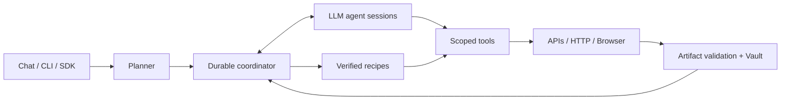

<p align="center">
  <picture>
    <source media="(prefers-color-scheme: dark)" srcset="web/public/brand/ore-inverse.svg">
    
  </picture>
</p>

<h1 align="center">ORE — Open Retrieval Engine</h1>
<p align="center">Define the mission. Collect the evidence.</p>

ORE is a self-hosted agent runtime for repeatable web retrieval. Describe what you need in chat, refine the plan, and collect files or structured content with a record of where each result came from.

Use it for general web extraction or scholarly collections, including article PDFs and supplementary files. The Python engine runs the work; the web console and TypeScript SDK provide access to it.

**Status:** `0.6.0rc2` · Install from source; packages have not been published to public registries. See [validation](VALIDATION.md) for tested behavior and remaining gaps.

## Agent architecture



- **Planner:** turns goals and follow-up answers into executable workflows. Plan mode keeps the plan available for review; Execute mode can start work within the user's configured scope.
- **Agent runtime:** preserves context across tool calls and delegated tasks. Codex is the default provider; optional Claude Code, OpenAI/Anthropic API and local API backends are also implemented.
- **Coordinator:** persists tasks, checkpoints, budgets and results. It starts with five workers, adapts concurrency within configured limits, and supports interruption and resume.
- **Rune protocols and recipes:** versioned site instructions define navigation and output requirements. Validated routines can run without an LLM; model downshifts require evaluation evidence.
- **Tools and Vault:** apply access rules, retrieve content, validate files, and retain hashes, source records and attachment relationships. Isolated browser executors and ordinary Chrome virtual desktops are optional deployments.

Scholarly discovery and file retrieval are separate. For journal archive missions, journal contents establish the requested inventory; configured publisher, API or open-access routes supply files. Missing articles, unresolved supplements and access failures remain visible in the result.

## Install and launch

Use Linux, Python 3.12+, [uv](https://docs.astral.sh/uv/), and Node.js 24+. For the default backend, install the Codex CLI and sign in with your account. Codex subscription mode does not require a GPU or an OpenAI API key.

```sh
git clone https://github.com/ts06068/ore.git
cd ore
uv sync --locked --extra scholarly
uv run playwright install --with-deps chromium

npm ci --prefix packages/sdk
npm run build --prefix packages/sdk
npm ci --prefix web
npm run build --prefix web

codex login
uv run ore doctor --browser
uv run ore serve --workers 5
```

Browser system dependencies may require administrator privileges. Open **http://127.0.0.1:8765** and sign in using the token stored in `.ore/operator.token`.

The scholarly extension is optional: omit `--extra scholarly` for general web tasks. Add `--extra claude` to `uv sync` to install the Claude Code adapter. Configure model and source connections through the console; enter credentials in protected connection controls.

## Use

Start a chat, for example:

> Find the original articles in JACC's June 2024 issues. Use the journal website to establish the article list, with Scopus as a fallback. Retrieve the main PDFs and supplements, and report anything missing.

Switch to **Plan** to discuss requirements before approving execution. The chat shows public activity summaries, collected files, progress, measured ETA when available, and requests for input. Use **Stop** to interrupt and **Resume** to continue. Conversations can be grouped by purpose; branches appear as a tree in the sidebar.

To connect a service, type **“Connect Codex”**, **“Connect Scopus”**, or **“Request a Scopus API key”** in chat. Connection cards provide official sign-in, protected credentials, API verification and review of proposed enrollment steps. Select the source access profile for the chat before collection. Existing keys and pending applications are reused.

For a repeatable command-line mission:

```sh
uv run ore run examples/web-paragraph.yaml
uv run ore jobs
uv run ore audit JOB_ID
uv run ore resume JOB_ID
```

Store custom missions as YAML and supply a versioned Rune with `ore run mission.yaml --rune protocol.yaml`. See [examples](examples/), the [TypeScript SDK](packages/sdk/README.md), and the server's `/docs` API reference.

Runtime state, credentials and collected artifacts live under `.ore/`, which is excluded from Git. Run retrieval executors on the network that provides the required source access. Unavailable or pending connections can be excluded; unresolved browser checks may require user input. ORE does not guarantee access to every site or exhaustive search coverage.

## Development and deployment

```sh
uv sync --locked --extra dev --extra scholarly
uv run pytest -q -m 'not live'
npm test --prefix packages/sdk
npm test --prefix web
uv run python scripts/build_release.py
```

Release builds produce Python distributions and an npm SDK tarball under `dist/`. See [Docker deployment](deploy/README.md), [Chrome desktops](docs/desktop-chrome.md), [native agent execution](docs/release-0.5.md), and [current release notes](docs/release-0.6-rc2.md) for configuration and implementation details.
