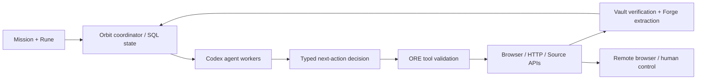

# ORE — Open Retrieval Engine

ORE는 사용자가 정의한 수집 프로토콜(Rune)을 LLM agent가 실행하는 연구용 Python 패키지입니다. 브라우저, 검색 API, 원문 다운로드, 검증과 작업 상태를 하나의 실행 기록으로 연결합니다. npm 패키지는 서버와 통신하는 TypeScript SDK이며, 실행 엔진은 Python입니다.

**현재 버전: 0.1.0.** 로컬 Codex의 ChatGPT 인증으로 실제 모델·브라우저·파일 저장 경로를 검증했습니다. GPU나 OpenAI API 키는 이 backend에 필요하지 않습니다. 기관 구독 권한, 모든 사이트의 자동화 허용 여부, 검색의 전 세계적 완전성은 패키지 설치로 확보되지 않습니다. 실행 증거와 미검증 범위는 [VALIDATION.md](VALIDATION.md)에 기록합니다.

## 설치와 실행

Linux/Python 3.12 이상을 기준으로 검증했습니다. 별도 브라우저 호스트 없이 로컬 실행하거나, Docker coordinator와 호스트 Codex worker를 연결할 수 있습니다.

```sh
# 이 저장소에서 개발/실행
uv sync --locked --extra dev --extra scholarly
# Chromium과 OS 라이브러리 설치. OS 라이브러리 설치에는 관리자 권한이 필요할 수 있습니다.
uv run playwright install --with-deps chromium
# 기존 ChatGPT 구독으로 인증한 Codex 설치가 필요합니다.
codex login status
uv run ore doctor --browser
uv run ore serve
```

`http://127.0.0.1:8765`를 열고 `.ore/operator.token` 파일의 운영자 토큰으로 로그인합니다. 토큰을 공개 URL이나 소스에 넣지 마세요. 작업 생성은 draft 상태이며 **Run**을 눌러 실행합니다. 이 작업 환경의 브라우저 라이브러리는 `.ore/browser-libs`에 별도로 준비되어 있습니다.

배포 파일은 `dist/`에 있습니다. 레지스트리 게시 없이 로컬 파일로 설치할 수 있습니다.

```sh
python3.12 -m pip install dist/ore_engine-0.1.0-py3-none-any.whl dist/ore_scholarly-0.1.0-py3-none-any.whl
npm install ./dist/ore-sdk-0.1.0.tgz
ore run examples/web-paragraph.yaml
ore jobs
ore audit JOB_ID
ore resume JOB_ID
```

`ore run`은 종료까지 실행하며 Ctrl-C 후 저장된 작업을 재개할 수 있습니다. 웹 API의 `refresh`는 새 관찰 세대를 만듭니다. 단순 `resume`은 같은 mission revision과 generation을 유지합니다. 새 지시는 revision을 증가시키고 이전 실행의 쓰기를 차단합니다.

## 실제 LLM agent의 동작

Codex app-server가 선택한 모델의 **구조화된 다음 행동**을 반환합니다. ORE가 폐쇄된 action schema를 검증하고 해당 도구를 실행합니다. DOM·화면·검색 결과·파일 검증 결과가 다음 모델 turn의 관찰로 들어갑니다. 이는 고정된 페이지 클릭 스크립트가 아니라 반복적인 LLM 판단 루프입니다.

현재 backend는 Codex의 native dynamic-tool dispatch를 사용하지 않습니다. 해당 경로가 code-mode host를 요구하는 것을 실측했고, 실행 경계를 넓히지 않는 schema-constrained action loop로 연결했습니다. Codex의 shell, native computer/browser tools, 외부 MCP, plugins와 code-mode host는 ORE 실행에서 비활성화합니다. 본래 Codex 인증 파일은 읽어 복제하지 않고 Codex가 자체 사용합니다.



원격 모델 사용 시 필요한 페이지 내용과 화면은 모델 제공자에게 전송됩니다. `external_model_content: metadata`는 페이지 텍스트와 이미지를 제외합니다. `none`은 remote Codex/API를 차단하며 `backend.kind: local`, `model_execution: institution_hosted`와 사설망 모델 endpoint를 명시해야 합니다. OpenAI·Anthropic·OpenAI-compatible local backend는 명시적으로 선택할 수 있으며 구독 한도 소진 시 유료 API로 자동 전환하지 않습니다. 이 세 API backend는 현재 live 인증 검증 대상이 아닙니다.

## 모델·경로 선택

Codex `model/list` 결과로 계정에서 실제 지원하는 모델과 reasoning effort를 확인합니다. 고정 모드는 사용자가 지정한 조합을 그대로 사용하며 미지원 값은 오류로 보고합니다. 자동 모드는 새로운 작업에 Astra/high를 사용하고, 실행 결과의 검증 실패가 이어지면 Astra/xhigh로 높입니다.

반복 추출·분류의 Terra/low, retrieval의 Sol/medium 선택에는 **실제 평가 보고서**가 필요합니다. 보고서 SHA-256, Rune digest, 작업 종류, fixture ID, 실제 사용 모델, 독립적인 기대 결과를 대조합니다. 최소 다섯 paired case를 통과한 기록 없이 낮은 모델이 동등하다고 가정하지 않습니다. 모델 비용·최적성 보장은 하지 않습니다. [평가 방법과 실행 형식](docs/evaluation.md)을 참조하세요.

원문 후보는 요청 버전, 예상 성공 확률, 지연 및 비용으로 정렬합니다. 비용 입력이 없으면 `uncalibrated_defaults`로 표시합니다. 후보 링크가 있다는 것과 실제 다운로드·내용 검증 성공은 별개입니다. Unpaywall의 accepted manuscript와 publisher의 published version을 자동으로 동등하게 처리하지 않습니다.

## Rune과 수집 대상

Rune은 설명뿐 아니라 scope·artifact roles·날짜·limits의 실행 기본값입니다. 명시적인 mission 설정이 Rune 기본값을 덮어씁니다. 프로토콜 내용의 해시를 작업에 저장합니다. 사용자가 입력한 모든 site별 임의 check 문자열이 자동 구현되는 것은 아니며, 사이트의 의미적 분류와 목록 대조에는 agent 관찰 및 감사가 필요합니다.

- **학술 검색:** PubMed, Crossref, WoS Starter/Expanded, Scopus, KCI OAI, ScienceON, DBpia.
- **원문 후보:** Unpaywall, 현재 PMC open-data JSON/JATS 및 개별 파일 경로.
- **브라우저/내보내기 경로:** Google Scholar, KISS, RISS 등은 공식 대량 검색 API가 구현된 것으로 표시하지 않습니다.
- **기본 Rune:** JACC, EHJ, Circulation, JAMA Cardiology, PLOS Medicine, HIR, 일반 웹.
- **일반 콘텐츠:** 브라우저 탐색, HTTP text/link 수집, CSS selector의 정확한 문단 추출, 원본 파일 저장과 text/table 파생물.

`examples/cardiology-archive.yaml`은 2006–2025년의 20개 완결 연도를 사용합니다. JAMA Cardiology의 2016년 창간 이전은 미발행 구간입니다. 20년 전체 원문 수집이 이 저장소에서 실행된 것은 아닙니다. WoS·Scopus 계정과 기관의 backfile entitlement를 각각 확인해야 합니다.

```yaml
name: My corpus
goal: Find primary original research, retrieve its main PDF and all supplements, and report unresolved access and coverage gaps.
sources: [pubmed, crossref]
artifact_roles: [main_pdf, supplement]
routing: {mode: auto}
budget: {max_turns: 60, max_seconds: 1800, max_agent_workers: 3}
```

논문 이름·DOI 기준 resource manifest, source별 관찰·cursor, SHA-256 기준 원본, 파생물과 ZIP member의 부모 관계를 보존합니다. 로그인 HTML을 PDF로 오인한 경우, 손상 파일, 다른 DOI, 버전 불일치와 supplement 미확인을 분리합니다. `completed`는 선언된 유한 범위의 감사 통과이며, report의 `global_recall`은 `unknown`입니다. 공식 목차 분모와 실제 대조 근거가 없으면 전수 완료를 주장하지 않습니다.

## 기관 접속, 비밀정보와 사람에게 인계

기관 IP·승인된 proxy는 **coordinator/browser가 실행되는 위치**에서 적용됩니다. 호스트 Codex만 기관망에 두는 것으로 browser 요청의 출구가 바뀌지 않습니다. `examples/institution-profile.json`을 UI Access profiles에 등록하고 실제 키는 비밀 저장소에 따로 저장합니다.

```sh
ore secret-set institution/scopus
ore secret-set institution/wos
ore secret-set institution/contact-email
```

입력은 숨김 프롬프트로 받습니다. access profile에는 `api_key_ref` 같은 참조만 넣습니다. 비밀번호·API 키·브라우저 세션은 로컬 암호화 저장소에 보관하며, 기본 암호화 키도 같은 호스트에 있으므로 호스트 접근 통제와 백업 보호가 필요합니다. 운영자에게 보이는 원격 브라우저 화면에는 민감한 내용이 표시될 수 있습니다. 비밀번호 입력 필드는 모델 screenshot에서 마스킹하며 이것이 모든 웹페이지의 민감정보를 완벽히 식별한다는 뜻은 아닙니다.

challenge가 감지되면 origin/auth-context별 지속 카운터로 최대 세 번, active-time 120초 이내의 일반 상호작용을 예약합니다. 재시도 횟수는 worker·mission 변경으로 초기화되지 않습니다. 해소되지 않으면 같은 브라우저를 사용자에게 넘기며 자동 관찰과 입력을 중지합니다. 화면 프레임과 입력 epoch를 확인해 오래된 화면 클릭을 거절합니다. browser process 자체가 재시작되면 DOM은 복원되지 않으며 암호화된 세션 상태로 새 브라우저를 열고 다시 관찰해야 합니다.

ORE는 익명성이나 bot challenge 성공을 보장하지 않습니다. publisher·기관·모델 제공자의 기록을 없애지 않습니다. URL/DNS 검사만으로 완전한 네트워크 격리를 보장하지 않으므로 강한 격리가 필요한 배포에서는 네트워크 계층의 outbound 제한도 설정해야 합니다.

## 병렬 배포와 저장소

```sh
# coordinator에는 기존 Codex 인증을 넣지 않습니다.
ore serve --workers 0
# Codex로 로그인한 별도 호스트에서 ORE_AUTH_TOKEN을 설정한 뒤:
ore worker --server http://127.0.0.1:8765 --parallel 4
```

SQLite는 로컬 실행, PostgreSQL은 공유 coordinator 상태에 사용할 수 있습니다. 작업 임대·fence·revision을 모든 완료/쓰기 시점에 확인합니다. 원격 worker별 모델 목록을 분리하며, 전체 job concurrency cap은 DB에서 원자적으로 적용합니다. origin/profile별 HTTP·browser 요청 속도와 429 지연도 DB에 저장합니다.

현재 배포는 **여러 agent worker와 하나의 coordinator/browser service**입니다. 여러 browser host의 분산 배포나 다중 사용자 SaaS는 구현된 기능으로 주장하지 않습니다. `max_turns`, token/byte budget과 challenge 카운터는 공유 저장되며 `max_seconds`는 각 task attempt의 실행 제한입니다. 구독 서비스의 정확한 남은 quota나 future token 소비량을 미리 보장하지 않습니다.

[Docker Compose 배포](deploy/README.md)는 PostgreSQL, 브라우저 및 UI를 포함하고 Codex는 호스트에 둡니다. 원본은 content-addressed local Vault에 저장합니다. 명시적인 S3 복제가 필요하면 다음을 사용합니다.

```sh
ore db-upgrade
ore vault-sync JOB_ID BUCKET_NAME --prefix ore
```

S3 복제는 검증된 파일만 전송하고 다시 읽어 SHA-256을 대조합니다. AWS/S3 호환 서버의 실제 인증 검증은 별도로 필요합니다. 초기 migration은 반복 적용 가능하며 파괴적인 downgrade 명령은 제공하지 않습니다.

## SDK와 개발 검증

```ts
import { OreClient } from '@ore/sdk';
const ore = new OreClient({ baseUrl: 'http://127.0.0.1:8765', token: process.env.ORE_AUTH_TOKEN });
const job = await ore.createJob({ goal: 'Collect the specified page', urls: ['https://example.com'], artifact_roles: ['excerpt'] });
await ore.action(job.id, 'run');
for await (const event of ore.events(job.id)) console.log(event.event);
```

```sh
uv run pytest -q -m 'not live'
uv run python scripts/build_release.py
```

브라우저 tests에는 Chromium과 OS 라이브러리가 필요합니다. `scripts/acceptance_codex.py`와 `scripts/calibrate_routing.py`는 실제 구독 모델 사용량을 소비합니다. `scripts/acceptance_oa.py`는 지정한 공개 논문 2건의 원본 파일을 내려받습니다. 배포물 해시는 `dist/SHA256SUMS`, 설치 검증은 `dist/release-manifest.json`에서 확인할 수 있습니다. CI 설정은 포함했지만 원격 CI 실행 여부는 별도입니다.
